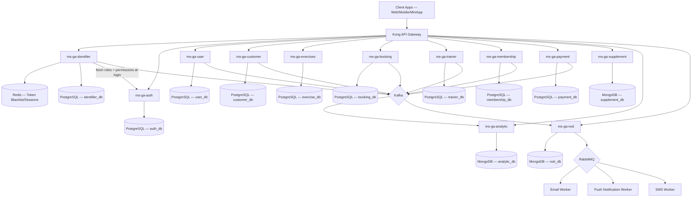
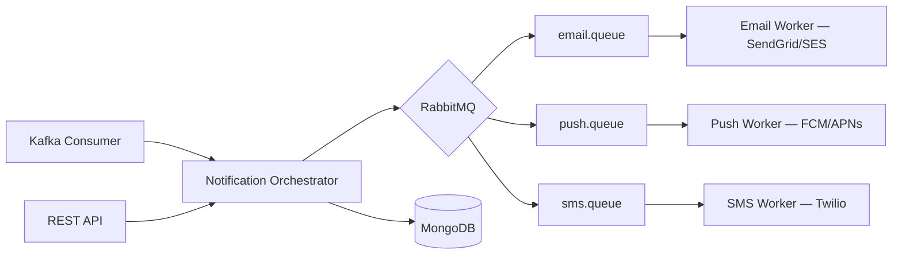
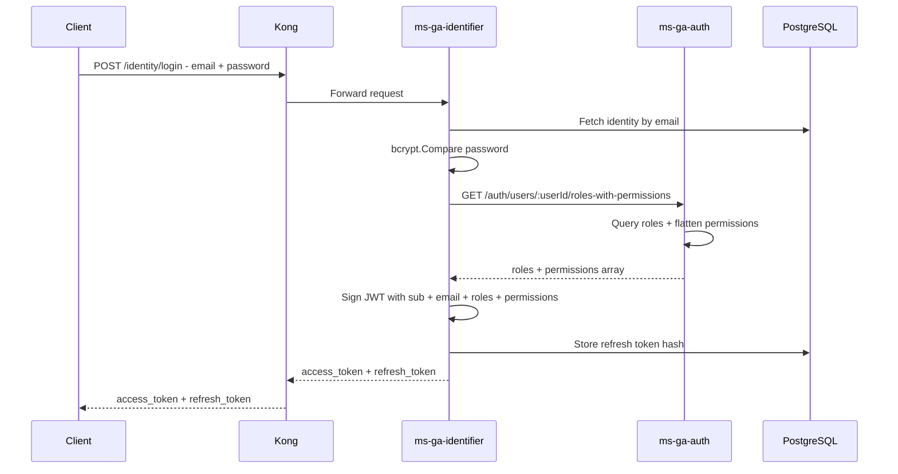
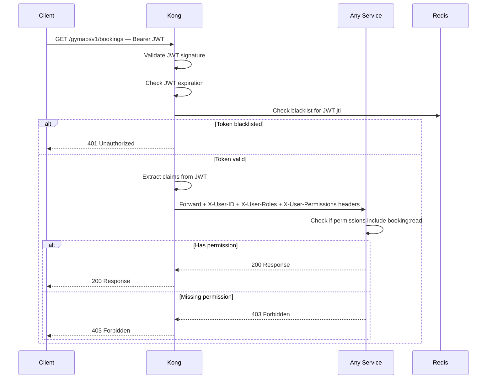
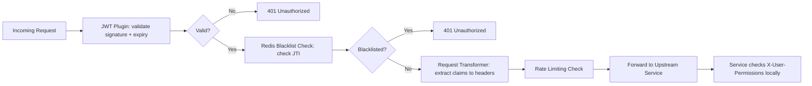
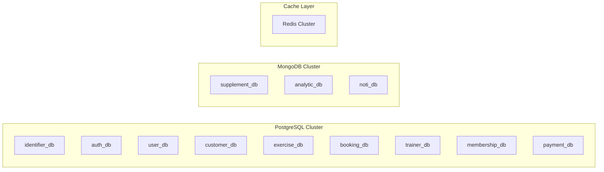
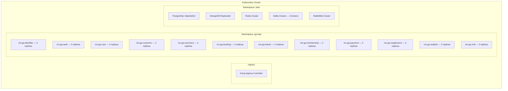

# GymAPI Microservices Architecture

## Table of Contents

1. [System Overview](#1-system-overview)
2. [High-Level Architecture](#2-high-level-architecture)
3. [Microservice Catalog](#3-microservice-catalog)
4. [Service Detail Design](#4-service-detail-design)
5. [Inter-Service Communication](#5-inter-service-communication)
6. [Authentication & Authorization](#6-authentication--authorization)
7. [API Gateway — Kong](#7-api-gateway--kong)
8. [Database Strategy](#8-database-strategy)
9. [Infrastructure & DevOps](#9-infrastructure--devops)
10. [Project Structure Standards](#10-project-structure-standards)
11. [Implementation Roadmap](#11-implementation-roadmap)

---

## 1. System Overview

GymAPI is a comprehensive gym management platform built as a polyglot microservices architecture. It manages everything from member registration and workout tracking to trainer scheduling, payments, and analytics.

### Core Principles

- **Database-per-Service**: Each microservice owns its data; no shared databases
- **API-First Design**: OpenAPI 3.0 specs defined before implementation
- **Event-Driven**: Asynchronous communication via Kafka for domain events; RabbitMQ for notifications
- **Clean Architecture**: Separation of concerns with domain, service, and infrastructure layers
- **JWT with Embedded Permissions**: Roles and permissions are embedded in the JWT at login time. No per-request authorization calls — services check permissions locally from JWT claims.
- **Identity vs Authorization Split**: `ms-ga-identifier` handles _who you are_ (login/register/token issuance); `ms-ga-auth` handles _what you can do_ (RBAC management — roles, permissions, role-permission mappings)
- **12-Factor App**: Environment-based configuration, stateless processes, disposable containers

---

## 2. High-Level Architecture



---

## 3. Microservice Catalog

| #   | Service            | Language | Framework    | Database           | Port | Description                                                                                                |
| --- | ------------------ | -------- | ------------ | ------------------ | ---- | ---------------------------------------------------------------------------------------------------------- |
| 1   | `ms-ga-identifier` | Go       | Gin          | PostgreSQL + Redis | 8081 | Identity — registration, login, logout, password reset, JWT token issuance with embedded roles/permissions |
| 2   | `ms-ga-auth`       | Java     | Spring Boot  | PostgreSQL         | 8082 | Authorization management — RBAC CRUD: roles, permissions, role-permission mappings, user-role assignments  |
| 3   | `ms-ga-user`       | Go       | Gin          | PostgreSQL         | 8083 | Internal user/staff profiles and directory                                                                 |
| 4   | `ms-ga-customer`   | Java     | Spring Boot  | PostgreSQL         | 8084 | Gym member profiles, body metrics, fitness goals                                                           |
| 5   | `ms-ga-exercises`  | Go       | Gin          | PostgreSQL         | 8080 | Exercise library, routines, workout sessions _(implemented)_                                               |
| 6   | `ms-ga-booking`    | Java     | Spring Boot  | PostgreSQL         | 8085 | Class/session booking, scheduling, availability                                                            |
| 7   | `ms-ga-trainer`    | Java     | Spring Boot  | PostgreSQL         | 8086 | Trainer profiles, certifications, schedules, assignments                                                   |
| 8   | `ms-ga-membership` | Go       | Gin          | PostgreSQL         | 8087 | Membership plans, subscriptions, renewals                                                                  |
| 9   | `ms-ga-payment`    | Java     | Spring Boot  | PostgreSQL         | 8088 | Payment processing, invoices, refunds, transaction history                                                 |
| 10  | `ms-ga-supplement` | Node.js  | Express + TS | MongoDB            | 8089 | Supplement catalog, inventory, orders, reviews                                                             |
| 11  | `ms-ga-analytic`   | Node.js  | Express + TS | DynamoDB           | 8090 | Dashboards, reports, workout analytics, business metrics                                                   |
| 12  | `ms-ga-noti`       | Node.js  | Express + TS | MongoDB + RabbitMQ | 8091 | Notification orchestration — email, push, SMS                                                              |

### Language Distribution Rationale

| Language                           | Services                                  | Rationale                                                                                                                                                                                                              |
| ---------------------------------- | ----------------------------------------- | ---------------------------------------------------------------------------------------------------------------------------------------------------------------------------------------------------------------------- |
| **Go — Gin**                       | identifier, user, exercises, membership   | High-performance, low-latency. Identifier is on the critical login path (bcrypt + JWT signing). Go's concurrency model handles high throughput with minimal memory.                                                    |
| **Java — Spring Boot**             | auth, customer, booking, trainer, payment | Rich business logic, complex domain models, strong transactional support. Auth (Spring Security) for RBAC, Payment needs enterprise-grade reliability. Spring's ecosystem (JPA, transactions, validation) excels here. |
| **Node.js — TypeScript + Express** | supplement, analytic, noti                | Flexible schema handling with MongoDB. Event-driven Kafka consumers for analytics. Async I/O for notification delivery.                                                                                                |

### Database Distribution Rationale

| Database       | Services                                                                           | Rationale                                                                                                                                                                                                |
| -------------- | ---------------------------------------------------------------------------------- | -------------------------------------------------------------------------------------------------------------------------------------------------------------------------------------------------------- |
| **PostgreSQL** | identifier, auth, user, customer, exercises, booking, trainer, membership, payment | Strong ACID compliance for transactional data. Relational integrity for credentials, roles, bookings, payments.                                                                                          |
| **MongoDB**    | supplement, noti                                                                   | Flexible schemas for product catalogs, notification templates.                                                                                                                                           |
| **DynamoDB**   | analytic                                                                           | Ultra-low latency for high-volume event ingestion. Time-series data (metrics by date/hour), key-value lookups (customer analytics), auto-scaling for peak event ingestion. TTL for raw event expiration. |
| **Redis**      | identifier + shared cache                                                          | Token blacklisting (logout), login attempt tracking, session management, rate limiting.                                                                                                                  |

---

## 4. Service Detail Design

### 4.1 ms-ga-identifier — Identity Service

**Language:** Go + Gin | **Database:** PostgreSQL + Redis

> **Purpose:** Manages _who you are_. Handles all credential lifecycle operations — registration, login, logout, password management, and JWT token issuance. At login time, it calls `ms-ga-auth` to fetch the user's roles and permissions, then **embeds them directly into the JWT**. This is the single entry point for authentication.

**Responsibilities:**

- User registration (email/password)
- Login — credential validation, call `ms-ga-auth` for roles/permissions, issue JWT with embedded claims
- Logout — blacklist the JWT's `jti` in Redis
- Token refresh — issue new access token using refresh token (re-fetches permissions from `ms-ga-auth`)
- Password reset flow (forgot password → email link → reset)
- Account status management (active, locked, suspended)
- Login attempt tracking and account lockout (5 failed attempts → 15 min lockout)
- Multi-device session management

**Domain Entities:**

- `Identity` — id, user_id (UUID, shared across system), email, password_hash, status (active/locked/suspended), email_verified, created_at, updated_at
- `RefreshToken` — id, identity_id, token_hash, device_info, ip_address, expires_at, created_at
- `LoginAttempt` — id, identity_id, ip_address, success, attempted_at
- `PasswordResetToken` — id, identity_id, token_hash, expires_at, used_at

**Key Endpoints:**

```
POST   /identity/register              — Create new account
POST   /identity/login                 — Authenticate and get tokens
POST   /identity/logout                — Blacklist current token
POST   /identity/refresh               — Refresh access token
POST   /identity/forgot-password       — Request password reset email
POST   /identity/reset-password        — Reset password with token
GET    /identity/verify-email/:token   — Verify email address
GET    /identity/sessions              — List active sessions
DELETE /identity/sessions/:id          — Revoke a specific session
PUT    /identity/change-password       — Change password (authenticated)
```

**Login Flow (detailed):**

1. Client sends `POST /identity/login` with email + password
2. Identifier validates credentials (bcrypt compare)
3. Identifier calls `ms-ga-auth` → `GET /auth/users/:userId/roles-with-permissions`
4. Auth returns: `{ roles: ["MEMBER"], permissions: ["booking:read", "booking:create", "exercise:read", ...] }`
5. Identifier generates JWT with all claims embedded
6. Identifier stores refresh token hash in PostgreSQL
7. Returns `{ access_token, refresh_token, expires_in }`

**JWT Token Issued (fat token with embedded permissions):**

```json
{
  "sub": "550e8400-e29b-41d4-a716-446655440000",
  "email": "member@gym.com",
  "roles": ["MEMBER"],
  "permissions": [
    "booking:read",
    "booking:create",
    "exercise:read",
    "subscription:read",
    "profile:read",
    "profile:update"
  ],
  "jti": "unique-token-id-for-blacklisting",
  "iat": 1700000000,
  "exp": 1700000900,
  "iss": "ms-ga-identifier"
}
```

**Events Published:**

- `identity.registered` → Kafka (triggers welcome email, customer profile creation)
- `identity.logged_in` → Kafka (analytics tracking)
- `identity.password_reset` → Kafka (security notification)
- `identity.account_locked` → Kafka (admin alert)

**Redis Usage:**

- `blacklist:<jti>` — Blacklisted token IDs (TTL = token remaining lifetime)
- `login_attempts:<identity_id>` — Failed login counter (TTL = 15 min, lockout after 5)
- `session:<identity_id>` — Active session tracking

---

### 4.2 ms-ga-auth — Authorization Management Service

**Language:** Java + Spring Boot | **Database:** PostgreSQL

> **Purpose:** Manages _what you can do_. This is a **management service** — it provides CRUD APIs for roles, permissions, and role-permission mappings. It is called by `ms-ga-identifier` at login time to fetch a user's effective permissions. It is NOT called on every business request (permissions are embedded in the JWT).

**Responsibilities:**

- Role definition and management (CRUD)
- Permission definition and management (CRUD)
- Role-permission mapping management
- User-role assignment (assign roles to user_ids)
- Provide a single endpoint to fetch all roles + permissions for a user (called by Identifier at login)
- Role hierarchy support

**Domain Entities:**

- `Role` — id, name, description, is_system (built-in vs custom), created_at
- `Permission` — id, resource, action, description (e.g., resource=`booking`, action=`create`)
- `RolePermission` — role_id, permission_id
- `UserRole` — user_id, role_id, assigned_by, assigned_at

**RBAC Roles (System Defaults):**

| Role          | Description                                  |
| ------------- | -------------------------------------------- |
| `SUPER_ADMIN` | Full system access                           |
| `GYM_ADMIN`   | Gym management, staff management             |
| `TRAINER`     | View assigned customers, manage own schedule |
| `MEMBER`      | Self-service: bookings, workouts, profile    |
| `STAFF`       | Front desk operations, check-ins             |

**Key Endpoints:**

```
GET    /auth/roles                                  — List all roles
POST   /auth/roles                                  — Create a role
GET    /auth/roles/:id                              — Get role details
PUT    /auth/roles/:id                              — Update a role
DELETE /auth/roles/:id                              — Delete a role
GET    /auth/roles/:id/permissions                  — Get permissions for a role
PUT    /auth/roles/:id/permissions                  — Set permissions for a role

GET    /auth/permissions                            — List all permissions
POST   /auth/permissions                            — Create a permission
PUT    /auth/permissions/:id                        — Update a permission
DELETE /auth/permissions/:id                        — Delete a permission

GET    /auth/users/:userId/roles                    — Get roles for a user
POST   /auth/users/:userId/roles                    — Assign role to user
DELETE /auth/users/:userId/roles/:roleId            — Remove role from user

GET    /auth/users/:userId/roles-with-permissions   — Get all roles + effective permissions (called by Identifier at login)
```

> **Note:** The `GET /auth/users/:userId/roles-with-permissions` endpoint is the critical integration point. It is called by `ms-ga-identifier` during login and token refresh. It returns the complete set of roles and flattened permissions for the user.

**Events Published:**

- `auth.role_assigned` → Kafka
- `auth.role_revoked` → Kafka
- `auth.permission_changed` → Kafka

---

### 4.3 ms-ga-user — Internal User/Staff Management

**Language:** Go + Gin | **Database:** PostgreSQL

**Responsibilities:**

- Staff/admin user profile CRUD
- Staff directory and search
- User status management (active, suspended, terminated)
- Profile details (department, hire date, emergency contact)

**Domain Entities:**

- `User` — id (same UUID as identity), first_name, last_name, email, phone, avatar_url, status, created_at, updated_at
- `UserProfile` — user_id, department, hire_date, emergency_contact_name, emergency_contact_phone
- `UserAddress` — user_id, street, city, state, zip, country

**Key Endpoints:**

```
GET    /users                  — List users (paginated, filterable)
GET    /users/:id              — Get user by ID
POST   /users                  — Create user profile
PUT    /users/:id              — Update user profile
DELETE /users/:id              — Soft-delete user
GET    /users/:id/profile      — Get extended profile
PUT    /users/:id/profile      — Update extended profile
GET    /users/search?q=        — Search users by name/email
```

**Events Published:**

- `user.created` → Kafka
- `user.updated` → Kafka
- `user.deactivated` → Kafka

---

### 4.4 ms-ga-customer — Gym Member Management

**Language:** Java + Spring Boot | **Database:** PostgreSQL

**Responsibilities:**

- Gym member profile management (separate from internal staff users)
- Body metrics tracking (weight, height, body fat %, BMI)
- Fitness goals management
- Member notes and tags
- Emergency contact info
- Member search with advanced filters

**Domain Entities:**

- `Customer` — id, user_id (FK to identity), first_name, last_name, email, phone, date_of_birth, gender, status, joined_at
- `BodyMetric` — id, customer_id, weight, height, body_fat_pct, bmi, measured_at
- `FitnessGoal` — id, customer_id, goal_type, target_value, current_value, deadline, status
- `CustomerNote` — id, customer_id, author_id, content, created_at
- `CustomerTag` — id, customer_id, tag_name

**Key Endpoints:**

```
GET    /customers                          — List members (paginated)
GET    /customers/:id                      — Get member by ID
POST   /customers                          — Create member profile
PUT    /customers/:id                      — Update member profile
DELETE /customers/:id                      — Soft-delete member
GET    /customers/:id/metrics              — Get body metrics history
POST   /customers/:id/metrics              — Record body metric
GET    /customers/:id/goals                — Get fitness goals
POST   /customers/:id/goals                — Create fitness goal
PUT    /customers/:id/goals/:goalId        — Update fitness goal
GET    /customers/search?q=&tag=&status=   — Advanced search
```

**Events Published:**

- `customer.created` → Kafka
- `customer.updated` → Kafka
- `customer.goal.achieved` → Kafka
- `customer.metric.recorded` → Kafka

---

### 4.5 ms-ga-exercises — Exercise & Workout Service _(Implemented)_

**Language:** Go + Gin | **Database:** PostgreSQL

**Responsibilities:**

- Exercise library management (CRUD)
- Workout routine templates
- Training session tracking (active workouts)
- Exercise filtering by muscle group, movement type, body half

**Domain Entities:** _(Already defined in codebase)_

- `Exercise` — id, name, muscles, movement_type, half, youtube_link, image_link, risk_of_injury, rating
- `Routine` — id, user_id, name, exercises
- `RoutineExercise` — id, routine_id, exercise_id, sets, reps, weight
- `Session` — id, user_id, name, exercises
- `SessionExercise` — id, session_id, exercise_id, sets, reps, weight, status

**Key Endpoints:** _(Already implemented)_

```
GET/POST           /exercises
GET/PUT/DELETE     /exercises/:id
GET/POST           /routines
GET/PUT/DELETE     /routines/:id
POST/PUT/DELETE    /routines/:id/exercises
GET/POST           /sessions
GET/PUT/DELETE     /sessions/:id
POST/PUT/DELETE    /sessions/:id/exercises
```

> **Refactor Note:** The current `ms-ga-exercises` validates JWT itself. After `ms-ga-identifier` is implemented, it should be refactored to read `X-User-ID` from Kong-injected headers and check permissions from JWT claims (`permissions` array) instead of re-validating the token.

---

### 4.6 ms-ga-booking — Class & Session Booking

**Language:** Java + Spring Boot | **Database:** PostgreSQL

**Responsibilities:**

- Gym class/group session management
- Class scheduling (recurring and one-off)
- Booking/reservation system with capacity limits
- Waitlist management
- Cancellation policies
- Trainer-to-class assignment
- Calendar view APIs

**Domain Entities:**

- `GymClass` — id, name, description, class_type, max_capacity, duration_minutes, trainer_id
- `ClassSchedule` — id, class_id, start_time, end_time, recurrence_rule, room, status
- `Booking` — id, customer_id, schedule_id, status (confirmed/cancelled/waitlisted/completed), booked_at
- `Waitlist` — id, customer_id, schedule_id, position, created_at
- `CancellationPolicy` — id, hours_before, penalty_type, penalty_value

**Key Endpoints:**

```
GET    /classes                                — List gym classes
POST   /classes                                — Create gym class
GET    /classes/:id                            — Get class details
PUT    /classes/:id                            — Update class
DELETE /classes/:id                            — Delete class
GET    /classes/:id/schedules                  — Get schedules for a class
POST   /classes/:id/schedules                  — Create schedule
GET    /schedules?date=&trainer_id=            — Search schedules
GET    /schedules/:id                          — Get schedule details
PUT    /schedules/:id                          — Update schedule
DELETE /schedules/:id                          — Delete schedule
POST   /schedules/:id/book                     — Book a spot
DELETE /schedules/:id/book                     — Cancel booking
GET    /schedules/:id/waitlist                 — View waitlist
GET    /bookings?customer_id=&status=&date_from=&date_to=  — Search bookings
GET    /bookings/:id                           — Get booking details
```

**Events Published:**

- `booking.created` → Kafka
- `booking.cancelled` → Kafka
- `booking.waitlist.promoted` → Kafka
- `class.schedule.created` → Kafka

---

### 4.7 ms-ga-trainer — Trainer Management

**Language:** Java + Spring Boot | **Database:** PostgreSQL

**Responsibilities:**

- Trainer profile management
- Certification and qualification tracking
- Trainer availability and schedule management
- Trainer-customer assignment (personal training)
- Trainer specialization tags
- Performance reviews from customers

**Domain Entities:**

- `Trainer` — id, user_id, first_name, last_name, email, phone, bio, specializations, status, hourly_rate
- `Certification` — id, trainer_id, name, issuing_body, issued_date, expiry_date, document_url
- `TrainerSchedule` — id, trainer_id, day_of_week, start_time, end_time, is_available
- `TrainerAssignment` — id, trainer_id, customer_id, start_date, end_date, status, notes
- `TrainerReview` — id, trainer_id, customer_id, rating, comment, created_at

**Key Endpoints:**

```
GET    /trainers                                    — List trainers
GET    /trainers/:id                                — Get trainer details
POST   /trainers                                    — Create trainer profile
PUT    /trainers/:id                                — Update trainer
DELETE /trainers/:id                                — Delete trainer
GET    /trainers/:id/certifications                 — List certifications
POST   /trainers/:id/certifications                 — Add certification
PUT    /trainers/:id/certifications/:certId         — Update certification
GET    /trainers/:id/schedule                       — Get availability
PUT    /trainers/:id/schedule                       — Update availability
GET    /trainers/:id/assignments                    — List assignments
POST   /trainers/:id/assignments                    — Create assignment
GET    /trainers/:id/reviews                        — List reviews
POST   /trainers/:id/reviews                        — Submit review
GET    /trainers/available?date=&specialization=    — Find available trainers
```

**Events Published:**

- `trainer.created` → Kafka
- `trainer.assigned` → Kafka
- `trainer.certification.expiring` → Kafka

---

### 4.8 ms-ga-membership — Membership & Subscription Management

**Language:** Go + Gin | **Database:** PostgreSQL

**Responsibilities:**

- Membership plan definition (monthly, quarterly, annual, day-pass)
- Customer subscription lifecycle (active, paused, expired, cancelled)
- Plan pricing and discount management
- Membership renewal and auto-renewal
- Freeze/pause membership
- Membership benefits and access levels
- Promo codes and trial periods

**Domain Entities:**

- `MembershipPlan` — id, name, description, duration_days, price, currency, benefits, max_freeze_days, status
- `Subscription` — id, customer_id, plan_id, start_date, end_date, status, auto_renew, payment_method_id
- `SubscriptionHistory` — id, subscription_id, action (created/renewed/paused/resumed/cancelled), performed_at, performed_by
- `PromoCode` — id, code, discount_type, discount_value, valid_from, valid_to, max_uses, current_uses
- `Freeze` — id, subscription_id, start_date, end_date, reason

**Key Endpoints:**

```
GET    /plans                              — List membership plans
GET    /plans/:id                          — Get plan details
POST   /plans                              — Create plan
PUT    /plans/:id                          — Update plan
DELETE /plans/:id                          — Delete plan
GET    /subscriptions?customer_id=&status= — List subscriptions
GET    /subscriptions/:id                  — Get subscription details
POST   /subscriptions                      — Create subscription
PUT    /subscriptions/:id                  — Update subscription
POST   /subscriptions/:id/renew            — Renew subscription
POST   /subscriptions/:id/pause            — Pause subscription
POST   /subscriptions/:id/resume           — Resume subscription
POST   /subscriptions/:id/cancel           — Cancel subscription
POST   /promo-codes                        — Create promo code
GET    /promo-codes/:code/validate         — Validate promo code
```

**Events Published:**

- `subscription.created` → Kafka
- `subscription.renewed` → Kafka
- `subscription.expiring_soon` → Kafka (7 days before)
- `subscription.expired` → Kafka
- `subscription.cancelled` → Kafka

---

### 4.9 ms-ga-payment — Payment & Billing

**Language:** Java + Spring Boot | **Database:** PostgreSQL

**Responsibilities:**

- Payment processing (integration-ready for Stripe/PayPal)
- Invoice generation
- Transaction history
- Refund management
- Payment method management
- Revenue reporting data
- Webhook handling from payment providers

**Domain Entities:**

- `PaymentMethod` — id, customer_id, type (card/bank/wallet), provider_token, last_four, is_default, status
- `Invoice` — id, customer_id, items, subtotal, tax, discount, total, currency, status (draft/pending/paid/overdue/cancelled), due_date
- `InvoiceItem` — id, invoice_id, description, item_type (membership/booking/supplement), reference_id, quantity, unit_price, total
- `Transaction` — id, invoice_id, customer_id, amount, currency, payment_method_id, provider_transaction_id, status (pending/completed/failed/refunded), processed_at
- `Refund` — id, transaction_id, amount, reason, status, processed_at

**Key Endpoints:**

```
GET    /payment-methods?customer_id=       — List payment methods
POST   /payment-methods                    — Add payment method
DELETE /payment-methods/:id                — Remove payment method
GET    /invoices?customer_id=&status=      — List invoices
GET    /invoices/:id                       — Get invoice details
POST   /invoices                           — Create invoice
POST   /invoices/:id/pay                   — Pay invoice
GET    /transactions?customer_id=&date_from=&date_to=  — List transactions
GET    /transactions/:id                   — Get transaction details
POST   /transactions/:id/refund            — Refund transaction
POST   /webhooks/stripe                    — Stripe webhook
POST   /webhooks/paypal                    — PayPal webhook
```

**Events Published:**

- `payment.completed` → Kafka
- `payment.failed` → Kafka
- `invoice.created` → Kafka
- `invoice.overdue` → Kafka
- `refund.processed` → Kafka

---

### 4.10 ms-ga-supplement — Supplement Store

**Language:** Node.js + TypeScript + Express | **Database:** MongoDB

**Responsibilities:**

- Supplement product catalog (proteins, vitamins, pre-workout, etc.)
- Category and brand management
- Inventory tracking
- Customer orders and order history
- Product reviews and ratings
- Product search with full-text search

**Domain Entities (MongoDB Documents):**

- `Product` — \_id, name, brand, category, description, price, currency, stock_quantity, images, nutrition_facts, tags, rating_avg, review_count, status
- `Category` — \_id, name, slug, parent_id, description, image_url
- `Order` — \_id, customer_id, items, subtotal, tax, total, status (pending/confirmed/shipped/delivered/cancelled), shipping_address, created_at
- `OrderItem` — product_id, product_name, quantity, unit_price, total
- `Review` — \_id, product_id, customer_id, rating, title, comment, created_at

**Key Endpoints:**

```
GET    /products?category=&brand=&search=&min_price=&max_price=  — Search products
GET    /products/:id                       — Get product details
POST   /products                           — Create product
PUT    /products/:id                       — Update product
DELETE /products/:id                       — Delete product
GET    /categories                         — List categories
POST   /categories                         — Create category
GET    /orders?customer_id=&status=        — List orders
GET    /orders/:id                         — Get order details
POST   /orders                             — Place order
PUT    /orders/:id/status                  — Update order status
GET    /products/:id/reviews               — List product reviews
POST   /products/:id/reviews               — Submit review
```

**Events Published:**

- `order.created` → Kafka
- `order.status.changed` → Kafka
- `product.low_stock` → Kafka

---

### 4.11 ms-ga-analytic — Analytics & Reporting

**Language:** Node.js + TypeScript + Express | **Database:** MongoDB

**Responsibilities:**

- Consume domain events from Kafka and build analytics aggregations
- Dashboard data APIs (member growth, revenue, attendance)
- Workout analytics (popular exercises, avg session duration)
- Business KPIs (churn rate, retention, revenue per member)
- Custom report generation
- Time-series data for charts

**Domain Entities (MongoDB Documents):**

- `AnalyticEvent` — \_id, event_type, source_service, payload, timestamp
- `DailyMetric` — \_id, date, metric_type, value, dimensions
- `MemberAnalytic` — \_id, customer_id, total_visits, avg_visit_duration, favorite_exercises, last_visit
- `RevenueMetric` — \_id, date, total_revenue, membership_revenue, supplement_revenue, booking_revenue
- `AttendanceMetric` — \_id, date, hour, check_ins, check_outs, peak_occupancy

**Key Endpoints:**

```
GET    /analytics/dashboard                    — Overview KPIs
GET    /analytics/members/growth?period=       — Member growth over time
GET    /analytics/members/:id/summary          — Individual member analytics
GET    /analytics/revenue?period=&group_by=    — Revenue breakdown
GET    /analytics/attendance?date=&period=     — Attendance patterns
GET    /analytics/exercises/popular?period=    — Most used exercises
GET    /analytics/trainers/performance         — Trainer utilization
GET    /analytics/reports/generate             — Custom report
```

**Events Consumed (from Kafka):**

- `identity.registered`, `identity.logged_in`
- `subscription.created`, `subscription.cancelled`, `subscription.expired`
- `payment.completed`
- `booking.created`, `booking.cancelled`
- `order.created`
- `customer.created`

---

### 4.12 ms-ga-noti — Notification Service

**Language:** Node.js + TypeScript + Express | **Database:** MongoDB + RabbitMQ

**Responsibilities:**

- Notification orchestration (decide what to send, when, how)
- Multi-channel delivery: email, push notification, SMS
- Notification templates management
- User notification preferences
- Notification history and read status
- Scheduled notifications (reminders)
- RabbitMQ workers for async delivery

**Domain Entities (MongoDB Documents):**

- `NotificationTemplate` — \_id, name, channel (email/push/sms), subject, body_template, variables
- `Notification` — \_id, customer_id, template_id, channel, status (pending/sent/delivered/failed/read), payload, sent_at, read_at
- `NotificationPreference` — \_id, customer_id, email_enabled, push_enabled, sms_enabled, quiet_hours_start, quiet_hours_end
- `ScheduledNotification` — \_id, trigger_event, delay_minutes, template_id, status

**Key Endpoints:**

```
POST   /notifications/send                          — Send notification
GET    /notifications?customer_id=&status=&channel= — List notifications
GET    /notifications/:id                           — Get notification details
PUT    /notifications/:id/read                      — Mark as read
GET    /notifications/preferences/:customerId       — Get preferences
PUT    /notifications/preferences/:customerId       — Update preferences
GET    /templates                                   — List templates
POST   /templates                                   — Create template
PUT    /templates/:id                               — Update template
DELETE /templates/:id                               — Delete template
```

**Notification Delivery Architecture:**



**Events Consumed (from Kafka):**

- `subscription.expiring_soon` → Send renewal reminder
- `booking.created` → Send booking confirmation
- `booking.waitlist.promoted` → Send waitlist promotion notice
- `payment.completed` → Send payment receipt
- `payment.failed` → Send payment failure alert
- `customer.goal.achieved` → Send congratulations
- `trainer.certification.expiring` → Send renewal reminder to trainer
- `identity.registered` → Send welcome email + email verification

---

## 5. Inter-Service Communication

### 5.1 Communication Patterns

```mermaid
graph TB
    subgraph Synchronous — REST at Login Time Only
        IdentifierSvc -->|fetch roles + permissions at login| AuthSvc
        BookingSvc -->|get trainer schedule| TrainerSvc
        BookingSvc -->|validate membership| MembershipSvc
        PaymentSvc -->|get subscription| MembershipSvc
        MembershipSvc -->|create invoice| PaymentSvc
    end

    subgraph Asynchronous — Kafka Events
        IdentifierSvc -->|identity.*| Kafka{Kafka}
        CustomerSvc -->|customer.*| Kafka
        MembershipSvc -->|subscription.*| Kafka
        PaymentSvc -->|payment.*| Kafka
        BookingSvc -->|booking.*| Kafka
        SupplementSvc -->|order.*| Kafka
        TrainerSvc -->|trainer.*| Kafka
        Kafka -->|consume events| AnalyticSvc
        Kafka -->|consume events| NotiSvc
    end
```

### 5.2 Login Flow — Identifier ↔ Auth Integration



### 5.3 Business Request Flow — JWT-Based Local Authorization



### 5.4 Kafka Topics

| Topic               | Producer         | Consumers                  | Description                        |
| ------------------- | ---------------- | -------------------------- | ---------------------------------- |
| `identity.events`   | ms-ga-identifier | analytic, noti             | Registration, login, logout events |
| `user.events`       | ms-ga-user       | analytic                   | Staff lifecycle events             |
| `customer.events`   | ms-ga-customer   | analytic, noti             | Member lifecycle events            |
| `exercise.events`   | ms-ga-exercises  | analytic                   | Workout completion events          |
| `booking.events`    | ms-ga-booking    | analytic, noti, trainer    | Booking lifecycle events           |
| `trainer.events`    | ms-ga-trainer    | analytic, noti, booking    | Trainer availability changes       |
| `membership.events` | ms-ga-membership | analytic, noti, payment    | Subscription lifecycle             |
| `payment.events`    | ms-ga-payment    | analytic, noti, membership | Payment lifecycle                  |
| `supplement.events` | ms-ga-supplement | analytic, noti             | Order lifecycle                    |
| `auth.events`       | ms-ga-auth       | analytic                   | Role/permission changes            |

### 5.5 RabbitMQ Queues (Notification Delivery)

| Queue              | Purpose                   | Worker                      |
| ------------------ | ------------------------- | --------------------------- |
| `noti.email`       | Email delivery jobs       | Email Worker (SendGrid/SES) |
| `noti.push`        | Push notification jobs    | Push Worker (FCM/APNs)      |
| `noti.sms`         | SMS delivery jobs         | SMS Worker (Twilio)         |
| `noti.dead-letter` | Failed notification retry | DLQ Processor               |

### 5.6 Synchronous Inter-Service Calls

For synchronous REST calls between services, we use internal service discovery via Kubernetes DNS:

- Service URL pattern: `http://<service-name>.<namespace>.svc.cluster.local:<port>`
- Circuit breaker pattern with retry (3 attempts, exponential backoff)
- Timeout: 5 seconds per call
- Correlation ID propagation via `X-Correlation-ID` header

---

## 6. Authentication & Authorization

### 6.1 Identity vs Auth — Separation of Concerns

| Concern                  | ms-ga-identifier                             | ms-ga-auth                                            |
| ------------------------ | -------------------------------------------- | ----------------------------------------------------- |
| **Question answered**    | _Who are you?_                               | _What can you do?_                                    |
| **Manages**              | Credentials, tokens, sessions                | Roles, permissions, policies                          |
| **Endpoints**            | /identity/\*                                 | /auth/\*                                              |
| **Called when**          | Every login/logout/refresh                   | Only at login time (by Identifier) + admin management |
| **Token responsibility** | Issues JWT with embedded roles + permissions | Provides roles-with-permissions data to Identifier    |
| **Data owned**           | identities, refresh_tokens, login_attempts   | roles, permissions, role_permissions, user_roles      |
| **Redis usage**          | Token blacklist, login attempts              | Not required (no per-request caching needed)          |

### 6.2 JWT Token Structure (Fat Token with Embedded Permissions)

```json
{
  "sub": "550e8400-e29b-41d4-a716-446655440000",
  "email": "member@gym.com",
  "roles": ["MEMBER"],
  "permissions": [
    "booking:read",
    "booking:create",
    "booking:cancel_own",
    "exercise:read",
    "routine:read",
    "routine:create",
    "routine:update_own",
    "session:read",
    "session:create",
    "subscription:read_own",
    "profile:read_own",
    "profile:update_own",
    "supplement:read",
    "supplement:order"
  ],
  "jti": "unique-token-id-for-blacklisting",
  "iat": 1700000000,
  "exp": 1700000900,
  "iss": "ms-ga-identifier"
}
```

### 6.3 Permission Naming Convention

Permissions follow the pattern `<resource>:<action>`:

| Permission              | Description                                |
| ----------------------- | ------------------------------------------ |
| `booking:read`          | View bookings                              |
| `booking:create`        | Create a booking                           |
| `booking:cancel_own`    | Cancel own booking                         |
| `booking:cancel_any`    | Cancel any booking (admin)                 |
| `exercise:read`         | View exercises                             |
| `exercise:create`       | Create exercises (admin)                   |
| `subscription:read_own` | View own subscription                      |
| `subscription:manage`   | Manage any subscription (admin)            |
| `payment:read_own`      | View own payment history                   |
| `payment:manage`        | Manage payments (admin)                    |
| `user:manage`           | Manage staff users (admin)                 |
| `customer:manage`       | Manage member profiles (admin)             |
| `trainer:manage`        | Manage trainer profiles (admin)            |
| `analytics:read`        | View analytics dashboards                  |
| `role:manage`           | Manage roles and permissions (super admin) |

### 6.4 RBAC Permission Matrix

| Resource           | SUPER_ADMIN | GYM_ADMIN |  TRAINER  |   MEMBER   | STAFF |
| ------------------ | :---------: | :-------: | :-------: | :--------: | :---: |
| Users (CRUD)       |     ✅      |    ✅     |    ❌     |     ❌     |  ❌   |
| Customers (CRUD)   |     ✅      |    ✅     | Read Own  | Read Self  | Read  |
| Exercises (CRUD)   |     ✅      |    ✅     |   Read    |    Read    | Read  |
| Bookings (CRUD)    |     ✅      |    ✅     | Read Own  |  CRUD Own  | Read  |
| Trainers (CRUD)    |     ✅      |    ✅     | Edit Self |    Read    | Read  |
| Memberships (CRUD) |     ✅      |    ✅     |    ❌     |  Read Own  | Read  |
| Payments (CRUD)    |     ✅      |    ✅     |    ❌     |  Read Own  | Read  |
| Supplements (CRUD) |     ✅      |    ✅     |    ❌     | Order/Read | Read  |
| Analytics          |     ✅      |    ✅     | Own Stats | Own Stats  |  ❌   |
| Notifications      |     ✅      |    ✅     |    Own    |    Own     |  Own  |
| Roles/Permissions  |     ✅      |   Read    |    ❌     |     ❌     |  ❌   |

### 6.5 How Services Check Permissions

Each service reads the `X-User-Permissions` header injected by Kong and checks locally:

**Go example:**

```go
func RequirePermission(permission string) gin.HandlerFunc {
    return func(c *gin.Context) {
        permissions := strings.Split(c.GetHeader("X-User-Permissions"), ",")
        for _, p := range permissions {
            if strings.TrimSpace(p) == permission {
                c.Next()
                return
            }
        }
        c.AbortWithStatusJSON(403, gin.H{"error": "Forbidden"})
    }
}
```

**Java example:**

```java
// In controller
@PreAuthorize("@permissionChecker.hasPermission(request, 'booking:create')")
public ResponseEntity<BookingResponse> createBooking(...) { ... }
```

**Node.js example:**

```typescript
const requirePermission =
  (permission: string) => (req: Request, res: Response, next: NextFunction) => {
    const permissions = (
      (req.headers["x-user-permissions"] as string) || ""
    ).split(",");
    if (permissions.includes(permission)) return next();
    res.status(403).json({ error: "Forbidden" });
  };
```

---

## 7. API Gateway — Kong

### 7.1 Route Configuration

| Route Pattern                 | Upstream Service      |  Auth Required  | Rate Limit  |
| ----------------------------- | --------------------- | :-------------: | ----------- |
| `/identity/**`                | ms-ga-identifier:8081 |   ❌ (public)   | 20 req/min  |
| `/auth/**`                    | ms-ga-auth:8082       | ✅ (admin only) | 100 req/min |
| `/gymapi/v1/users/**`         | ms-ga-user:8083       |       ✅        | 100 req/min |
| `/gymapi/v1/customers/**`     | ms-ga-customer:8084   |       ✅        | 100 req/min |
| `/gymapi/v1/exercises/**`     | ms-ga-exercises:8080  |  ✅ (partial)   | 200 req/min |
| `/gymapi/v1/bookings/**`      | ms-ga-booking:8085    |       ✅        | 100 req/min |
| `/gymapi/v1/classes/**`       | ms-ga-booking:8085    |       ✅        | 100 req/min |
| `/gymapi/v1/trainers/**`      | ms-ga-trainer:8086    |       ✅        | 100 req/min |
| `/gymapi/v1/memberships/**`   | ms-ga-membership:8087 |       ✅        | 100 req/min |
| `/gymapi/v1/payments/**`      | ms-ga-payment:8088    |       ✅        | 50 req/min  |
| `/gymapi/v1/supplements/**`   | ms-ga-supplement:8089 |       ✅        | 100 req/min |
| `/gymapi/v1/analytics/**`     | ms-ga-analytic:8090   |       ✅        | 50 req/min  |
| `/gymapi/v1/notifications/**` | ms-ga-noti:8091       |       ✅        | 100 req/min |

### 7.2 Kong Plugins

| Plugin                    | Purpose                                | Scope                     |
| ------------------------- | -------------------------------------- | ------------------------- |
| **JWT**                   | Token signature + expiry validation    | Global (except /identity) |
| **Redis Blacklist Check** | Check JTI against Redis blacklist      | Global (except /identity) |
| **Rate Limiting**         | Throttle requests                      | Per-route                 |
| **CORS**                  | Cross-origin support                   | Global                    |
| **Request Transformer**   | Extract JWT claims → X-User-\* headers | Global                    |
| **Logging**               | Request/response logging               | Global                    |
| **Correlation ID**        | Trace requests across services         | Global                    |

### 7.3 Kong Request Processing Flow



---

## 8. Database Strategy

### 8.1 Database Per Service

Each service owns its database. No direct cross-database queries.



### 8.2 Migration Strategy

| Database   | Migration Tool | Pattern                                    |
| ---------- | -------------- | ------------------------------------------ |
| PostgreSQL | Flyway         | Versioned SQL migrations (V1**, V2**, ...) |
| MongoDB    | migrate-mongo  | JavaScript migration scripts               |

### 8.3 Redis Usage

| Use Case        | Key Pattern                    | TTL                 | Service          |
| --------------- | ------------------------------ | ------------------- | ---------------- |
| JWT Blacklist   | `blacklist:<jti>`              | Token remaining TTL | ms-ga-identifier |
| Login Attempts  | `login_attempts:<identity_id>` | 15 min              | ms-ga-identifier |
| Active Sessions | `session:<identity_id>`        | 7 days              | ms-ga-identifier |
| Rate Limiting   | `ratelimit:<ip>:<route>`       | 1 min               | Kong             |

---

## 9. Infrastructure & DevOps

### 9.1 Docker Compose (Development)

Each service has its own `docker-compose.yml` for local development. A root-level `docker-compose.yml` orchestrates all services together.

### 9.2 Kubernetes Architecture



### 9.3 Kubernetes Resources Per Service

Each service includes:

- `Deployment` — with readiness and liveness probes
- `Service` — ClusterIP for internal communication
- `ConfigMap` — Non-sensitive configuration
- `Secret` — Database credentials, JWT secrets, API keys
- `HorizontalPodAutoscaler` — CPU/memory-based scaling
- `NetworkPolicy` — Restrict inter-service communication

### 9.4 Health Check Endpoints (All Services)

| Endpoint      | Purpose                             | Used By    |
| ------------- | ----------------------------------- | ---------- |
| `GET /health` | Liveness probe                      | Kubernetes |
| `GET /ready`  | Readiness probe (includes DB check) | Kubernetes |

### 9.5 Observability

| Tool                    | Purpose                                                                          |
| ----------------------- | -------------------------------------------------------------------------------- |
| **Structured Logging**  | JSON logs with correlation IDs (Zap for Go, SLF4J for Java, Winston for Node.js) |
| **Distributed Tracing** | OpenTelemetry with Jaeger                                                        |
| **Metrics**             | Prometheus + Grafana                                                             |
| **Log Aggregation**     | ELK Stack or Loki                                                                |

---

## 10. Project Structure Standards

### 10.1 Go Services (Gin) — Clean Architecture

Applies to: `ms-ga-identifier`, `ms-ga-auth`, `ms-ga-user`, `ms-ga-exercises`, `ms-ga-membership`

```
ms-ga-{service}/
├── api/
│   └── openapi.yaml              # OpenAPI 3.0 spec
├── cmd/
│   └── api/
│       └── main.go               # Entry point
├── internal/
│   ├── api/
│   │   ├── generated/            # oapi-codegen models
│   │   ├── handler/              # HTTP handlers
│   │   └── router/               # Route definitions
│   ├── converter/                # DTO <-> Entity mappers
│   ├── domain/
│   │   ├── entity/               # Domain entities
│   │   └── repository/           # Repository interfaces
│   ├── infrastructure/
│   │   ├── persistence/
│   │   │   └── gorm/
│   │   │       ├── mapper/       # Entity <-> Model mappers
│   │   │       ├── model/        # GORM models
│   │   │       └── repository/   # Repository implementations
│   │   ├── messaging/            # Kafka producer
│   │   └── external/             # HTTP clients for other services
│   ├── middleware/                # Auth, CORS, correlation ID, permission check
│   └── service/                  # Business logic
├── pkg/
│   ├── config/                   # Configuration loading
│   ├── database/                 # DB connection
│   └── utils/                    # Logger, helpers
├── db/
│   └── migrations/               # Flyway SQL migrations
├── docker-compose.yml
├── Dockerfile
├── Makefile
├── go.mod
└── README.md
```

### 10.2 Java Services (Spring Boot) — Hexagonal Architecture

Applies to: `ms-ga-customer`, `ms-ga-booking`, `ms-ga-trainer`, `ms-ga-payment`

```
ms-ga-{service}/
├── src/
│   ├── main/
│   │   ├── java/com/gymapi/{service}/
│   │   │   ├── GaServiceApplication.java
│   │   │   ├── adapter/
│   │   │   │   ├── in/
│   │   │   │   │   └── web/
│   │   │   │   │       ├── controller/       # REST controllers
│   │   │   │   │       ├── dto/              # Request/Response DTOs
│   │   │   │   │       └── mapper/           # DTO mappers
│   │   │   │   └── out/
│   │   │   │       ├── persistence/
│   │   │   │       │   ├── entity/           # JPA entities
│   │   │   │       │   ├── mapper/           # Entity mappers
│   │   │   │       │   └── repository/       # JPA repositories
│   │   │   │       └── messaging/            # Kafka producer
│   │   │   ├── application/
│   │   │   │   ├── port/
│   │   │   │   │   ├── in/                   # Use case interfaces
│   │   │   │   │   └── out/                  # Port interfaces
│   │   │   │   └── service/                  # Use case implementations
│   │   │   ├── domain/
│   │   │   │   └── model/                    # Domain models
│   │   │   └── config/                       # Spring configuration
│   │   └── resources/
│   │       ├── application.yml
│   │       ├── application-dev.yml
│   │       └── db/migration/                 # Flyway migrations
│   └── test/
├── docker-compose.yml
├── Dockerfile
├── pom.xml
└── README.md
```

### 10.3 Node.js Services (TypeScript + Express) — Clean Architecture

Applies to: `ms-ga-supplement`, `ms-ga-analytic`, `ms-ga-noti`

```
ms-ga-{service}/
├── src/
│   ├── app.ts                    # Express app setup
│   ├── server.ts                 # Entry point
│   ├── config/
│   │   └── index.ts              # Configuration
│   ├── api/
│   │   ├── controllers/          # Route handlers
│   │   ├── middlewares/          # Permission check, validation, error handling
│   │   ├── routes/               # Route definitions
│   │   └── validators/           # Request validation (Zod)
│   ├── application/
│   │   ├── services/             # Business logic
│   │   └── interfaces/           # Service interfaces
│   ├── domain/
│   │   ├── entities/             # Domain models
│   │   └── repositories/         # Repository interfaces
│   ├── infrastructure/
│   │   ├── database/             # DB connection (Mongoose)
│   │   ├── repositories/         # Repository implementations
│   │   ├── messaging/            # Kafka consumer/producer, RabbitMQ
│   │   └── external/             # External service clients
│   └── shared/
│       ├── errors/               # Custom error classes
│       ├── logger/               # Winston logger
│       └── utils/                # Helpers
├── tests/
├── docker-compose.yml
├── Dockerfile
├── package.json
├── tsconfig.json
└── README.md
```

---

## 11. Implementation Roadmap

### Phase 1 — Foundation (Identity + Authorization + Gateway)

- [ ] Set up Kong API Gateway with JWT plugin + Redis blacklist check + Request Transformer
- [ ] Set up Kafka cluster (Docker Compose for dev)
- [ ] Set up Redis instance
- [ ] Implement `ms-ga-auth` (RBAC — roles, permissions, user-role assignment, roles-with-permissions endpoint)
- [ ] Implement `ms-ga-identifier` (registration, login with permission embedding, logout, refresh tokens)
- [ ] Implement `ms-ga-user` (staff management)
- [ ] Refactor `ms-ga-exercises` to use Kong-injected `X-User-*` headers for permission checks

### Phase 2 — Core Business

- [ ] Implement `ms-ga-customer` (member profiles, body metrics, goals)
- [ ] Implement `ms-ga-membership` (plans, subscriptions, freeze/pause)
- [ ] Implement `ms-ga-payment` (invoices, transactions, refunds)
- [ ] Implement `ms-ga-trainer` (profiles, certifications, schedules)

### Phase 3 — Operations

- [ ] Implement `ms-ga-booking` (classes, scheduling, reservations, waitlist)
- [ ] Set up RabbitMQ for notification delivery
- [ ] Implement `ms-ga-noti` (notification orchestration + email/push/SMS workers)

### Phase 4 — Intelligence & Store

- [ ] Implement `ms-ga-supplement` (product catalog, orders, reviews)
- [ ] Implement `ms-ga-analytic` (Kafka consumers, dashboards, KPIs)

### Phase 5 — Production Readiness

- [ ] Kubernetes manifests for all services
- [ ] CI/CD pipelines
- [ ] Monitoring and alerting (Prometheus + Grafana)
- [ ] Distributed tracing (OpenTelemetry + Jaeger)
- [ ] Load testing and performance tuning
- [ ] Security audit

---

## Appendix A: Event Schema Standard

All Kafka events follow a consistent envelope:

```json
{
  "event_id": "uuid",
  "event_type": "identity.registered",
  "source": "ms-ga-identifier",
  "timestamp": "2026-02-28T08:30:00Z",
  "correlation_id": "uuid",
  "version": "1.0",
  "data": {
    "user_id": "uuid",
    "email": "member@example.com"
  }
}
```

## Appendix B: API Response Standard

All services follow a consistent response format:

**Success:**

```json
{
  "success": true,
  "data": {},
  "meta": {
    "page": 1,
    "limit": 20,
    "total": 150
  }
}
```

**Error:**

```json
{
  "success": false,
  "error": {
    "code": "VALIDATION_ERROR",
    "message": "Invalid input",
    "details": [{ "field": "email", "message": "must be a valid email" }]
  }
}
```

## Appendix C: Shared Libraries

To avoid code duplication, create shared packages:

| Package              | Language | Contents                                                                                                      |
| -------------------- | -------- | ------------------------------------------------------------------------------------------------------------- |
| `gymapi-go-common`   | Go       | Logger (Zap), config loader, middleware (correlation ID, permission check), response helpers, Kafka producer  |
| `gymapi-java-common` | Java     | Exception handling, response DTOs, base entity, Kafka producer config, permission check filter                |
| `gymapi-node-common` | Node.js  | Logger (Winston), error classes, Kafka/RabbitMQ clients, response helpers, permission middleware, Zod schemas |
