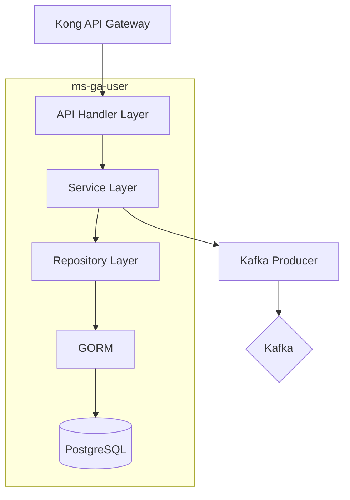

# ms-ga-user — Internal User/Staff Management Service

## Overview

| Property         | Value                |
| ---------------- | -------------------- |
| **Language**     | Go 1.23+             |
| **Framework**    | Gin                  |
| **Database**     | PostgreSQL 15 (GORM) |
| **Port**         | 8083                 |
| **Base Path**    | `/gymapi/v1/users`   |
| **Architecture** | Clean Architecture   |

**Purpose:** Manages internal gym staff and admin user profiles. This service stores the profile data (name, department, contact info) for users who have credentials in `ms-ga-identifier`. The `user_id` UUID is shared across both services. Note: Gym _members_ (customers) are managed by `ms-ga-customer`, not this service.

---

## Architecture Diagram



---

## Project Structure

```
ms-ga-user/
├── api/
│   └── openapi.yaml
├── cmd/
│   └── api/
│       └── main.go
├── internal/
│   ├── api/
│   │   ├── generated/
│   │   │   └── models.gen.go
│   │   ├── handler/
│   │   │   ├── user_handler.go         # User CRUD
│   │   │   └── profile_handler.go      # Extended profile
│   │   └── router/
│   │       └── router.go
│   ├── converter/
│   │   └── user_converter.go
│   ├── domain/
│   │   ├── entity/
│   │   │   ├── user.go
│   │   │   ├── user_profile.go
│   │   │   └── user_address.go
│   │   └── repository/
│   │       ├── user_repository.go
│   │       └── profile_repository.go
│   ├── infrastructure/
│   │   ├── persistence/
│   │   │   └── gorm/
│   │   │       ├── mapper/
│   │   │       │   └── mapper.go
│   │   │       ├── model/
│   │   │       │   ├── user.go
│   │   │       │   ├── user_profile.go
│   │   │       │   └── user_address.go
│   │   │       └── repository/
│   │   │           ├── user_repository.go
│   │   │           └── profile_repository.go
│   │   └── messaging/
│   │       └── kafka_producer.go
│   ├── middleware/
│   │   ├── auth_middleware.go
│   │   └── correlation_id.go
│   └── service/
│       ├── user_service.go
│       └── profile_service.go
├── pkg/
│   ├── config/
│   │   └── config.go
│   ├── database/
│   │   └── postgres.go
│   └── utils/
│       ├── logger.go
│       └── response.go
├── db/
│   └── migrations/
│       ├── V1__create_users_table.sql
│       ├── V2__create_user_profiles_table.sql
│       └── V3__create_user_addresses_table.sql
├── docker-compose.yml
├── Dockerfile
├── Makefile
├── go.mod
└── README.md
```

---

## Domain Entities

### `User`

```go
type User struct {
    ID        uuid.UUID
    FirstName string
    LastName  string
    Email     string
    Phone     *string
    AvatarURL *string
    Status    UserStatus  // active | suspended | terminated
    CreatedAt time.Time
    UpdatedAt time.Time
}

type UserStatus string
const (
    UserStatusActive     UserStatus = "active"
    UserStatusSuspended  UserStatus = "suspended"
    UserStatusTerminated UserStatus = "terminated"
)
```

### `UserProfile`

```go
type UserProfile struct {
    UserID                  uuid.UUID
    Department              *string
    HireDate                *time.Time
    EmergencyContactName    *string
    EmergencyContactPhone   *string
    Notes                   *string
    UpdatedAt               time.Time
}
```

### `UserAddress`

```go
type UserAddress struct {
    ID        uuid.UUID
    UserID    uuid.UUID
    Street    string
    City      string
    State     *string
    ZipCode   *string
    Country   string
    IsPrimary bool
    CreatedAt time.Time
    UpdatedAt time.Time
}
```

---

## Repository Interfaces

### `UserRepository`

```go
type UserFilter struct {
    Status    string
    Search    string  // searches first_name, last_name, email
    Page      int
    Limit     int
}

type UserRepository interface {
    Create(ctx context.Context, user *entity.User) (*entity.User, error)
    GetByID(ctx context.Context, id uuid.UUID) (*entity.User, error)
    GetByEmail(ctx context.Context, email string) (*entity.User, error)
    GetAll(ctx context.Context, filter UserFilter) ([]*entity.User, int64, error)
    Update(ctx context.Context, user *entity.User) (*entity.User, error)
    UpdateStatus(ctx context.Context, id uuid.UUID, status entity.UserStatus) error
    SoftDelete(ctx context.Context, id uuid.UUID) error
}
```

### `ProfileRepository`

```go
type ProfileRepository interface {
    GetByUserID(ctx context.Context, userID uuid.UUID) (*entity.UserProfile, error)
    Upsert(ctx context.Context, profile *entity.UserProfile) (*entity.UserProfile, error)
    GetAddressesByUserID(ctx context.Context, userID uuid.UUID) ([]*entity.UserAddress, error)
    UpsertAddress(ctx context.Context, address *entity.UserAddress) (*entity.UserAddress, error)
}
```

---

## Database Schema

### `users` table

```sql
CREATE TABLE users (
    id          UUID PRIMARY KEY,  -- Same UUID as identity.user_id
    first_name  VARCHAR(100) NOT NULL,
    last_name   VARCHAR(100) NOT NULL,
    email       VARCHAR(255) NOT NULL UNIQUE,
    phone       VARCHAR(20),
    avatar_url  TEXT,
    status      VARCHAR(20) NOT NULL DEFAULT 'active'
                CHECK (status IN ('active', 'suspended', 'terminated')),
    deleted_at  TIMESTAMPTZ,        -- Soft delete
    created_at  TIMESTAMPTZ NOT NULL DEFAULT NOW(),
    updated_at  TIMESTAMPTZ NOT NULL DEFAULT NOW()
);

CREATE INDEX idx_users_email ON users(email);
CREATE INDEX idx_users_status ON users(status);
CREATE INDEX idx_users_deleted_at ON users(deleted_at);
```

### `user_profiles` table

```sql
CREATE TABLE user_profiles (
    user_id                   UUID PRIMARY KEY REFERENCES users(id) ON DELETE CASCADE,
    department                VARCHAR(100),
    hire_date                 DATE,
    emergency_contact_name    VARCHAR(200),
    emergency_contact_phone   VARCHAR(20),
    notes                     TEXT,
    updated_at                TIMESTAMPTZ NOT NULL DEFAULT NOW()
);
```

### `user_addresses` table

```sql
CREATE TABLE user_addresses (
    id          UUID PRIMARY KEY DEFAULT gen_random_uuid(),
    user_id     UUID NOT NULL REFERENCES users(id) ON DELETE CASCADE,
    street      VARCHAR(255) NOT NULL,
    city        VARCHAR(100) NOT NULL,
    state       VARCHAR(100),
    zip_code    VARCHAR(20),
    country     VARCHAR(100) NOT NULL DEFAULT 'Thailand',
    is_primary  BOOLEAN NOT NULL DEFAULT FALSE,
    created_at  TIMESTAMPTZ NOT NULL DEFAULT NOW(),
    updated_at  TIMESTAMPTZ NOT NULL DEFAULT NOW()
);

CREATE INDEX idx_user_addresses_user_id ON user_addresses(user_id);
```

---

## API Endpoints

All endpoints require JWT authentication. Role-based access is enforced via `X-User-Permissions` header.

#### `GET /gymapi/v1/users`

```yaml
Required Permission: user:manage OR customer:read (for staff directory)
Query Params:
  status: string (active|suspended|terminated)
  search: string (name or email)
  page: integer (default: 1)
  limit: integer (default: 20, max: 100)

Response 200:
  success: true
  data:
    users:
      - id: uuid
        first_name: string
        last_name: string
        email: string
        phone: string
        avatar_url: string
        status: string
        created_at: datetime
  meta:
    page: integer
    limit: integer
    total: integer
```

#### `GET /gymapi/v1/users/:id`

```yaml
Required Permission: user:manage OR profile:read_own (own profile)

Response 200:
  success: true
  data:
    id: uuid
    first_name: string
    last_name: string
    email: string
    phone: string
    avatar_url: string
    status: string
    created_at: datetime
    updated_at: datetime
```

#### `POST /gymapi/v1/users`

```yaml
Required Permission: user:manage

Request:
  id: uuid (required, must match identity.user_id)
  first_name: string (required)
  last_name: string (required)
  email: string (required)
  phone: string (optional)

Response 201:
  success: true
  data: (created user)
```

#### `PUT /gymapi/v1/users/:id`

```yaml
Required Permission: user:manage OR profile:update_own (own profile)

Request:
  first_name: string (optional)
  last_name: string (optional)
  phone: string (optional)
  avatar_url: string (optional)

Response 200:
  success: true
  data: (updated user)
```

#### `DELETE /gymapi/v1/users/:id`

```yaml
Required Permission: user:manage

Response 200:
  success: true
  data:
    message: "User deactivated."

Note: Soft delete — sets deleted_at timestamp
```

#### `GET /gymapi/v1/users/:id/profile`

```yaml
Required Permission: user:manage OR profile:read_own

Response 200:
  success: true
  data:
    user_id: uuid
    department: string
    hire_date: date
    emergency_contact_name: string
    emergency_contact_phone: string
    addresses:
      - id: uuid
        street: string
        city: string
        state: string
        zip_code: string
        country: string
        is_primary: boolean
```

#### `PUT /gymapi/v1/users/:id/profile`

```yaml
Required Permission: user:manage OR profile:update_own

Request:
  department: string (optional)
  hire_date: date (optional)
  emergency_contact_name: string (optional)
  emergency_contact_phone: string (optional)

Response 200:
  success: true
  data: (updated profile)
```

#### `GET /gymapi/v1/users/search`

```yaml
Required Permission: user:manage

Query Params:
  q: string (required, min 2 chars)

Response 200:
  success: true
  data:
    users: [...]
```

---

## Kafka Events Published

### `user.created`

```json
{
  "event_type": "user.created",
  "source": "ms-ga-user",
  "data": {
    "user_id": "uuid",
    "email": "staff@gym.com",
    "first_name": "Jane",
    "last_name": "Smith"
  }
}
```

### `user.updated`

```json
{
  "event_type": "user.updated",
  "source": "ms-ga-user",
  "data": {
    "user_id": "uuid",
    "changed_fields": ["phone", "department"]
  }
}
```

### `user.deactivated`

```json
{
  "event_type": "user.deactivated",
  "source": "ms-ga-user",
  "data": {
    "user_id": "uuid",
    "email": "staff@gym.com"
  }
}
```

---

## Configuration

```yaml
PORT: "8083"
APP_ENV: "development"

DB_HOST: "localhost"
DB_PORT: "5432"
DB_USER: "postgres"
DB_PASS: "postgres"
DB_NAME: "user_db"

JWT_SECRET: "your-256-bit-secret"

KAFKA_BROKERS: "kafka:9092"
KAFKA_TOPIC_USER: "user.events"
```
